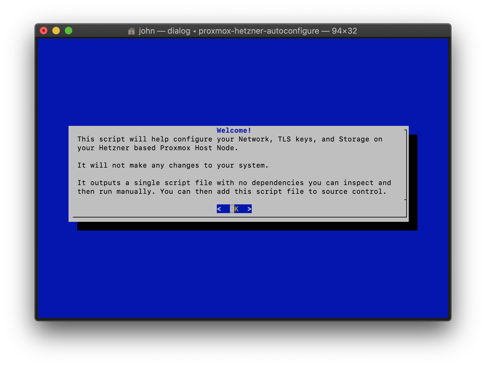

.. raw:: html

   <!-- PROJECT LOGO -->

.. raw:: html

   

     <h1 align="center">

Proxmox Hetzner Autoconfigure

.. raw:: html

   </h1>
     

       

Takes over where the Hetzner installimage left off

.. raw:: html

   

   

   <!-- ABOUT THE PROJECT -->

About This Project
------------------

This is a command line ``dialog`` based tool to help configure a freshly
installed Proxmox host node on a Hetzner dedicated server.

The application will ask you a series of questions to ascertain how
you'd like your server to be setup, and output a neat, well documented
``boostrap.sh`` script you can execute on your Proxmox host to configure
things like Networking, Storage, and TLS.

Things this project will help configure and whether they are implemented
yet:

-  [x] Setting up the Network
-  [x] Routed topology where you have purchased an additional subnet
-  [x] Routed topology where you have purchased separate IPs
-  [ ] Bridged topology where you have purchased an additional subnet
-  [ ] Bridged topology where you have purchased separate IPs
-  [ ] Single IP (port forwarding, SNI)
-  [x] TLS with LetsEncrypt / ACME
-  [x] Mounting a Hetzner Storage Box
-  [x] Setting up LMV-Thin
-  [ ] DNS and DHCP (DNSMasq)
-  [ ] Wireguard

Hopefully this script saves some people some time. I'll try and update
it as I learn new and better ways to do things with Proxmox.

   Image of Yaktocat

.. raw:: html

   <!-- GETTING STARTED -->

Getting Started
---------------

To install the binary locally follow these steps:

Prerequisites
~~~~~~~~~~~~~

Needs a `dialog <https://linux.die.net/man/1/dialog>`__ like program in
your search path. This is available on most Linux operating systems
through the native package managers and on MacOS through ``brew``.
Windows users might have more trouble, although running through WSL or a
VM would work.

You also need `Python 3.6 or above <https://www.python.org/>`__ and pip,
if they're not already installed.

For example, on Debian:

.. code:: sh

    $ apt install dialog python3-pip

Installation
~~~~~~~~~~~~

1. Install the package using the python3 version of pip.

.. code:: sh

    $ pip3 install proxmox_hetzner_autoconfigure

.. raw:: html

   <!-- USAGE EXAMPLES -->

Usage
-----

.. code:: sh

    $ proxmox_hetzner_autoconfigure

Then follow the instructions. The application does not need to be run as
root and will not make any changes to your system. It also does not need
to be run on your Proxmox host node. It's better to run it locally and
not pollute your host node with unnecessary dependencies.

It will ask you a series of questions using the venerable ``dialog``
application to ascertain how you would like your Proxmox system setup,
and then output a simple shell (Bash) script ``boostrap.sh`` that can be
run on your Proxmox host node.

``bootstrap.sh`` has no dependencies and can easily be added to source
control to document your system setup and for disaster recovery
scenarios.

Development Setup
~~~~~~~~~~~~~~~~~

-  Requires a working installation of `Python 3.6 or
   above <https://www.python.org/>`__,
   `dialog <https://linux.die.net/man/1/dialog>`__ and
   `Poetry <https://python-poetry.org/>`__.
-  Checkout the source code using ``git``

.. code:: sh

    $ git clone https://github.com/johnknott/proxmox-hetzner-autoconfigure.git

-  From within the project directory, fetch the dependencies using
   ``poetry``.

.. code:: sh

    $ poetry install

-  From within the project directory, run the application using
   ``poetry``.

.. code:: sh

    $ poetry run main

-  From within the project directory, run the test-suite using
   ``poetry``.

.. code:: sh

    $ poetry run pytest

.. raw:: html

   <!-- ROADMAP -->

Roadmap
-------

See the `open
issues <https://github.com/johnknott/proxmox-hetzner-autoconfigure/issues>`__
for a list of proposed features (and known issues).

.. raw:: html

   <!-- CONTRIBUTING -->

Contributing
------------

Contributions are what make the open source community such an amazing
place to be learn, inspire, and create. Any contributions you make are
**greatly appreciated**.

1. Fork the Project
2. Create your Feature Branch
   (``git checkout -b feature/AmazingFeature``)
3. Commit your Changes (``git commit -m 'Add some AmazingFeature'``)
4. Push to the Branch (``git push origin feature/AmazingFeature``)
5. Open a Pull Request

.. raw:: html

   <!-- LICENSE -->

License
-------

Distributed under the MIT License. See ``LICENSE`` for more information.

.. raw:: html

   <!-- CONTACT -->

Contact
-------

John Knott - [@johndknott](https://twitter.com/johndknott) -
john.knott@gmail.com

Project Link: https://github.com/johnknott/proxmox-hetzner-autoconfigure

.. raw:: html

   <!-- MARKDOWN LINKS & IMAGES -->
   <!-- https://www.markdownguide.org/basic-syntax/#reference-style-links -->

